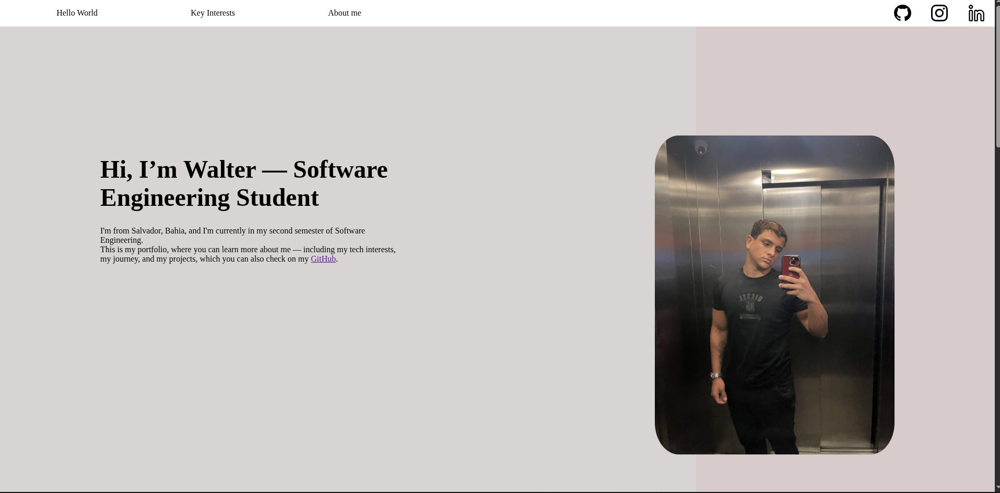

# 💼 Walter Soares - Portfolio

Welcome to my personal portfolio!
This project was developed to show my main interests, goals and skills

🔗You can see live preview here 😄 👉: https://walterasoaresf.github.io/portfolio-dev/

---

## ✏️ About the project

this is my personal portfolio website, built with HTML, CSS and a lil bit of JavaScript.
this presents who i am, my technical interests and a bit about my journey in software enginner

the goal of this project is to improve my front end development skills and pratice my design skills

---

## 🛠️ Technologies Used

- HTML5
- CSS3 (Flexbox & Grid)
- JavaScript (DOM manipulation)
- Responsive Design (Mobile First)

---

- ## 📱 Features

- Responsive layout (mobile and desktop)
- Interactive navigation menu (hamburger menu)
- Horizontal image carousel
- Dynamic content interaction (Key Interests section)
- Clean and minimal UI design

- ## 🧠 What I Learned

- Structuring semantic HTML
- Creating responsive layouts with Flexbox and Grid
- Handling DOM events with JavaScript
- Improving UI/UX design decisions
- Organizing a real project for GitHub

---

## 🎯 Future Improvements

- Improve animations and transitions
- - Add dark mode 🌙
- Integrate backend (future project)
- Optimize performance and accessibility

---

- ## 👨‍💻 About Me

Hi, my name is Walter. I'm from Salvador, Brazil, and I'm currently in my second semester of Software Engineering.

I’m passionate about:
- Operating Systems
- Cybersecurity
- AI and Automation
- Software Development

---

- ## 📌 Notes

This project is part of my learning journey. Feedback is always welcome!
- Add dark mode 🌙
- Integrate backend (future project)
- Optimize performance and accessibility
